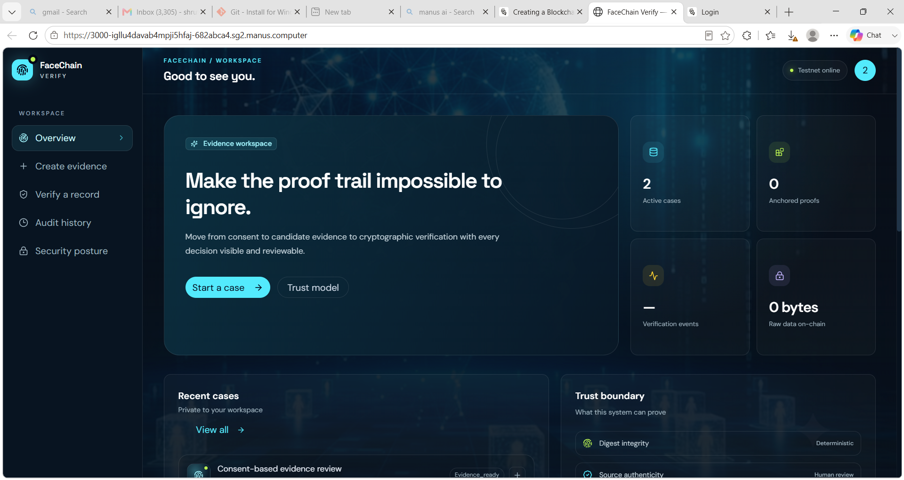
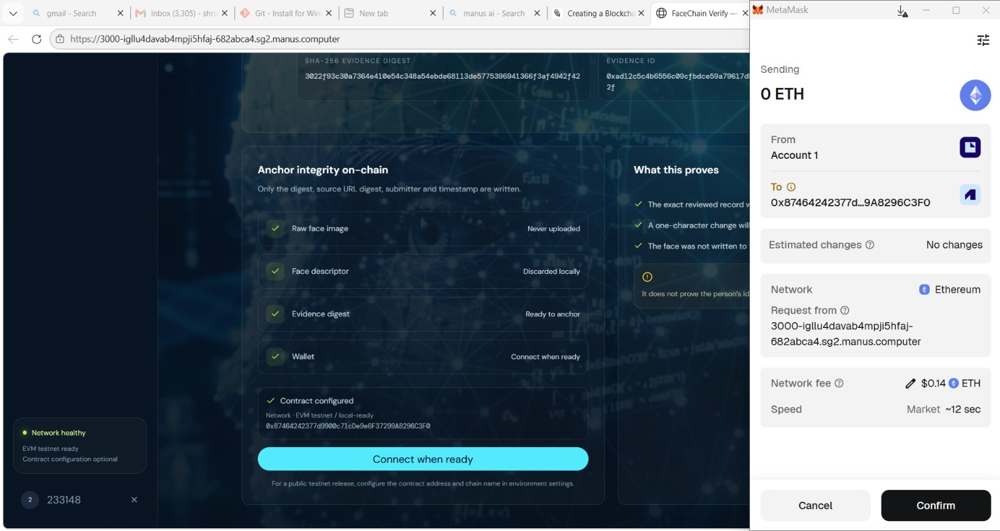
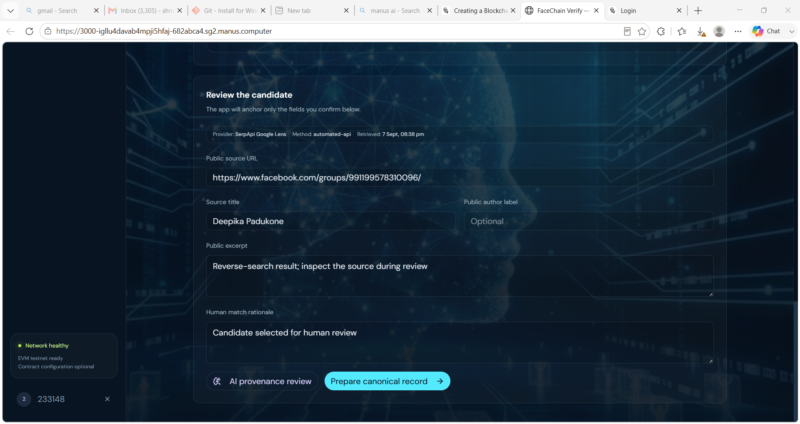
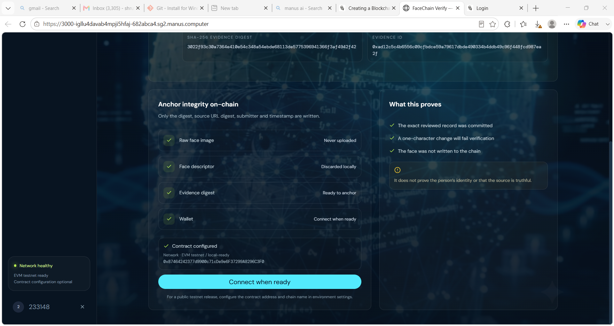

# FaceChain Verify

FaceChain Verify is a privacy-first evidence verification workspace that turns consented public-web evidence into a tamper-evident blockchain commitment. The proof anchors the integrity of an evidence record, **not a person’s identity**.

## Application Screenshots

### 1. Consent & case creation


### 2. Browser-local face scan


### 3. Automated candidate search


### 4. Evidence workspace overview



### 5. Reverse-search candidates


### 6. Blockchain anchoring with MetaMask



### 7. Human review before anchoring



### 8. On-chain integrity boundary



### 9. Audit history


## Automated Search & Verify workflow

1. The user explicitly consents and selects a supported JPG or PNG image.
2. The browser validates the image and performs face gating locally. Zero faces stop the flow; one face continues; multiple faces require a different image.
3. The user clicks one **Search & Verify** action. There is no manual Google Lens upload, browser handoff, or pasted JSON step.
4. The server validates the image again, uploads it to the configured SerpApi Image API, receives an `image_id`, and submits that identifier to SerpApi’s Google Lens engine.
5. The typed `ReverseSearchProvider` adapter normalizes only fields returned by the provider, extracts actual result URLs, and filters candidates to supported public social platforms.
6. Candidate image URLs are passed to the browser-local face comparison module. When a candidate image is accessible and contains exactly one face, the module computes a real `@vladmandic/face-api` Euclidean-distance-derived similarity score. If the image cannot be fetched or has no single face, the UI shows **Comparison unavailable** or **No single face detected** rather than inventing a score.
7. A qualifying candidate is selected automatically when its real similarity score meets the configured review threshold. The user can inspect and edit the public evidence metadata before preparing the canonical record.
8. The canonical, domain-separated SHA-256 evidence digest can then be anchored through the `ProofRegistry` EVM contract. Verification recomputes the local digest and compares it with the chain record, returning **PASS**, **FAIL**, **MISSING**, or **DUPLICATE** semantics.

## Reverse-search provider

FaceChain Verify uses `SerpApiGoogleLensProvider`, which implements the typed `ReverseSearchProvider` interface in `server/pipeline.ts`. This is a legitimate third-party Google-Lens-compatible API integration; it does not claim that Google exposes an official public Lens API.

The provider sequence is documented by SerpApi:

- [Google Lens API](https://serpapi.com/google-lens-api)
- [Google Lens image upload](https://serpapi.com/google-lens-upload-an-image)
- [SerpApi pricing](https://serpapi.com/pricing)

The server first posts the binary image to `https://serpapi.com/image`, reads the returned `image_id`, and calls `https://serpapi.com/search.json?engine=google_lens&image_id=...`. The frontend never receives or sends the provider key. Results are never hardcoded, and no match score is generated from a URL alone.

### Provider pricing and configuration

The official SerpApi pricing page currently lists a **Free plan at $0/month with 250 searches per month and 50 searches per hour**. Availability and terms can change, so the provider documentation and account plan remain authoritative. A server-side API key is still required even for the free plan.

Configure the key as:

```bash
SERPAPI_API_KEY=your_server_only_serpapi_key
```

If the key is missing, the API returns `provider_unconfigured` and the UI displays a configuration error. If the provider rejects the upload/search, the API returns `provider_failed`. The application never falls back to manual search or fabricates candidates.

The adapter can be replaced later by implementing:

```ts
interface ReverseSearchProvider {
  readonly provider: string;
  readonly mode: "automated-api";
  search(image: Buffer, mimeType: "image/jpeg" | "image/png"): Promise<ReverseSearchResult>;
}
```

### Result states

| State | Meaning |
| --- | --- |
| `provider_unconfigured` | The server-side provider key is missing. |
| `provider_failed` | The configured provider rejected or could not complete the request. |
| `no_supported_social_results` | Genuine provider results were received, but none matched the supported public social domains. |
| `ready` | At least one genuine supported social-platform candidate is available for local face comparison and human review. |
| `rejected` | Image validation or the local face-count gate failed. |

Supported social domains currently include Instagram, Facebook, LinkedIn, X/Twitter, and TikTok. A reverse-search result is a **candidate source**, not identity proof.

## Privacy and security boundaries

Raw face images and embeddings are not persisted by the application or placed on a public blockchain. The browser keeps the reference descriptor in memory only for the current Search & Verify action. Candidate image URLs are fetched for local comparison when the source permits it; the descriptor and raw candidate pixels are not uploaded to the application backend or written to the chain.

Consent is required before processing. Retention and deletion controls apply to off-chain case metadata. Public blockchain commitments are immutable and cannot be deleted. Secrets, wallet keys, database credentials, and contract configuration must be supplied through the environment or project secret manager, never committed to source control.

## Technology and versions

The application uses React 19, Tailwind CSS 4, Express 4, tRPC 11, Drizzle ORM with MySQL/TiDB, Ethers.js 6, Solidity 0.8.x, `@vladmandic/face-api` 1.7.15, TypeScript 5.9, Vite 7, and Vitest 2. Exact dependency ranges are recorded in `package.json` and resolved in `pnpm-lock.yaml`.

## Environment and blockchain configuration

The project environment provides authentication, database, storage, and built-in service variables. Automated reverse search additionally requires the server-only `SERPAPI_API_KEY`. Blockchain operation requires the deployment/network variables documented in `contracts/DEPLOYMENT.md`, including the RPC URL, deployer private key, contract address, chain ID, and explorer base URL as applicable. Do not expose private keys in client code.

## Commands

```bash
pnpm install
pnpm check
pnpm test
pnpm build
pnpm dev
```

For a configured EVM testnet deployment, review `contracts/DEPLOYMENT.md` and run:

```bash
pnpm contract:deploy
```

## Testing and auditability

The automated suite covers image validation, face gating, candidate normalization, the SerpApi upload/search sequence, provider configuration failures, typed `pipeline.run` states, frontend status copy, hashing, rate limiting, authentication and role guards, evidence procedures, contract compilation/privacy properties, and blockchain verification logic. Pipeline logs expose image validation, face detection, ephemeral encoding, automated reverse search, candidate filtering, and face-match status. Audit events record provider mode, result counts, state, threshold metadata, and downstream evidence identifiers without storing biometric material.

## Known limitations

SerpApi usage is subject to the provider’s current quota, availability, terms, and result indexing. Candidate image comparison depends on the provider returning an accessible image URL and the source permitting browser image loading; in other cases the UI reports that comparison is unavailable instead of producing a score. A similarity score is a candidate signal and is not identity proof. Wallet connection and EVM anchoring require a compatible wallet, network, and deployed contract configuration. Browser-local face detection depends on model loading and device capability and is not a substitute for a regulated biometric-identification service.
